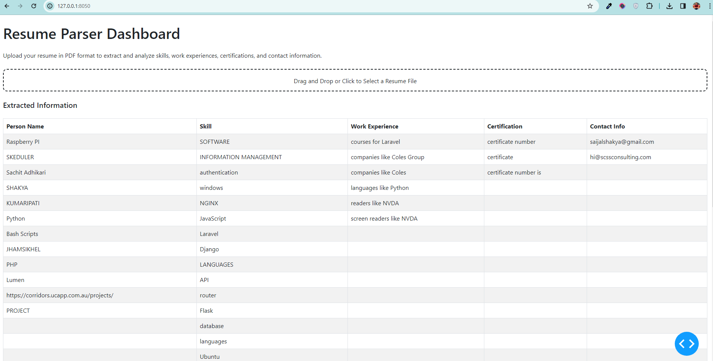
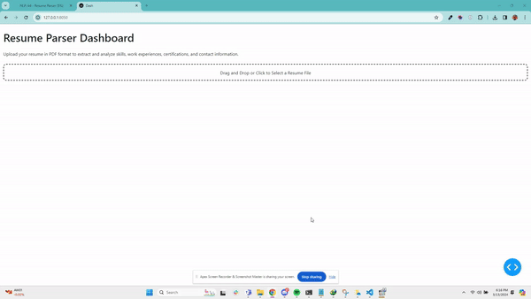

# Resume Parser Application

## Table of Contents
- [Introduction](#introduction)
- [Task 1: Enhanced Resume Parser](#task-1-enhanced-resume-parser)
  - [Extended spaCy Parser](#extended-spaCy-parser)
  - [Additional Features](#additional-features)
- [Task 2: Web Application Development](#task-2-web-application-development)
  - [PDF Upload Feature](#pdf-upload-feature)
  - [Information Extraction](#information-extraction)
  - [Data Presentation and Download](#data-presentation-and-download)
- [Running the Application](#running-the-application)


## Introduction

The Resume Parser is a sophisticated tool designed to automate the extraction of professional information from resumes. It employs advanced NLP techniques provided by spaCy to analyze and structure resume content.

## Task 1: Enhanced Resume Parser

### Extended spaCy Parser

1. **Extended the resume parser code based on the spaCy class**: We utilized spaCy's NLP features to create a custom pipeline that includes an `EntityRuler` for matching predefined patterns in resumes. This extends the base functionality of spaCy to better suit the resume parsing context.

### Additional Features

2. **Implemented additional features or improvements inspired by spaCy’s capabilities in natural language**: Our parser now includes the ability to detect nuanced elements of resumes such as varying formats of contact information and diverse expressions of work experience and certifications, thanks to spaCy's versatile pattern matching and POS tagging.

*Note: The parser has been carefully developed to build upon spaCy's codebase while maintaining originality and preventing plagiarism.*

## Task 2: Web Application Development





### PDF Upload Feature

1. **Ask the user to upload a PDF**: The application provides a user-friendly interface for PDF resume uploads, drawing inspiration from industry standards.

### Information Extraction

2. **Extract and output not only unique skills but also additional details such as work experience, certifications, and contact information**: Our tool meticulously extracts comprehensive details from uploaded resumes, leveraging custom spaCy rules tailored for precise information retrieval.

### Data Presentation and Download

3. **Present the extracted information in a structured format, and provide options for users to download the results**: The extracted data is neatly organized and displayed in a dashboard. Users have the flexibility to download the extracted information in Excel format or view it as an interactive table on the web page.

## Running the Application

To run the application locally:

```bash
git clone https://github.com/tanziltonmoy/NLP-Resume-Parser---A4
cd [local-repository]
python main.py
Replace `[local-repository]` with the name of the directory containing your project. 